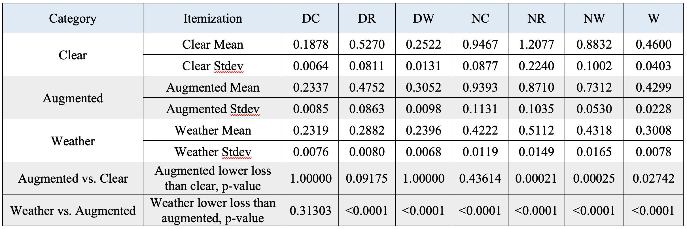

<div align="center">   

# Enhancing Autonomous Vehicle Perception in Adverse Weather through Image Augmentation during Semantic Segmentation Training
</div>

<h3 align="center">
  <a href="https://doi.org/10.48550/arXiv.2408.07239">arXiv</a>
</h3>



## Table of Contents:
1. [Abstract](#abstract)
2. [Anaysis](#analysis)
3. [News](#news)
4. [TODO](#todos)
5. [License](#license)
6. [Citation](#citation)
7. [Resource](#resource)

## Abstract <a name="high"></a>
- :robot: **Perception**: Robust perception is crucial in autonomous vehicle navigation and localization. Visual processing tasks, like semantic segmentation, should work in varying weather conditions and during different times of day. Semantic segmentation is where each pixel is assigned a class, which is useful for locating overall features. Training a segmentation model requires large amounts of data, and the labeling process for segmentation data is especially tedious. Additionally, many large datasets include only images taken in clear weather. This is a problem because training a model exclusively on clear weather data hinders performance in adverse weather conditions like fog or rain. 
- :trophy: **Augmentation Segmentation**: We hypothesize that given a dataset of only clear days images, applying image augmentation (such as random rain, fog, and brightness) during training allows for domain adaptation to diverse weather conditions. We used CARLA, a 3D realistic autonomous vehicle simulator, to collect 1200 images in clear weather composed of 29 classes from 10 different towns. We also collected 1200 images of random weather effects. We trained encoder-decoder UNet models to perform semantic segmentation. Applying augmentations significantly improved segmentation under weathered night conditions (p < 0.001). However, models trained on weather data have significantly lower losses than those trained on augmented data in all conditions except for clear days. This shows there is room for improvement in the domain adaptation approach. Future work should test more types of augmentations and also use real-life images instead of CARLA. Ideally, the augmented model meets or exceeds the performance of the weather model.

## Analysis <a name="analysis"></a>
- The results show evidence that when only training on clear-day images, applying image augmentation improves model performance during adverse weather conditions.
- There is also statistically significant evidence that augmentations decrease test loss in night-time rain or night-time random weather conditions.

## News <a name="news"></a>
- **`Jul 2024 - Sep 2024`** Publication on [arXiv](https://doi.org/10.48550/arXiv.2408.07239) and submission on [Journal of Emerging Investigators](https://emerginginvestigators.org)
- **`Jan 2024 - Jun 2024`** Participate in [Synopsys Silicon Valley Science and Technology Championship](https://science-fair.org) with Awards and bug fixes.
- **`Sep 2023 - Mar 2024`** Polygence research with initial code implementation.

## TODO <a name="todos"></a>
- [ ] Custom augmentations outside of the Albumentation library should be used.
- [ ] Dataset of more diverse weather conditions can be improved for autonomous vehicle simulation.
- [ ] The significance testing method could be improved.

## License <a name="license"></a>
All assets and code are under the [Apache 2.0 license](./LICENSE) unless specified otherwise.

## Citation <a name="citation"></a>
Please consider citing our paper if the project helps your research with the following information:
```
@misc{kou2024enhancingautonomousvehicleperception,
      title={Enhancing Autonomous Vehicle Perception in Adverse Weather through Image Augmentation during Semantic Segmentation Training}, 
      author={Ethan Kou and Noah Curran},
      year={2024},
      eprint={2408.07239},
      archivePrefix={arXiv},
      primaryClass={cs.CV},
      url={https://arxiv.org/abs/2408.07239}, 
}
```

## Resource
[](https://awesome.re)
- [EKF](https://github.com/BubblyBingBong/EKF) and [PID](https://github.com/BubblyBingBong/PID) ( :rocket:Ours!)
- Isola, Phillip, et al. "Image-to-Image Translation with Conditional Adversarial Networks." Proceedings of the IEEE conference on computer vision and pattern recognition, Jul 2017. https://doi.org/10.1109/CVPR.2017.632.
- Dosovitskiy, Alexey, et al. "CARLA: An open urban driving simulator." Conference on robot learning PMLR, Nov 2017. https://doi.org/10.48550/arXiv.1711.03938.
- Cordts, Marius, et al. "The cityscapes dataset for semantic urban scene understanding." Proceedings of the IEEE Conference on Computer Vision and Pattern Recognition, Jun 2016. https://doi.org/10.48550/arXiv.1604.01685.
- Ahmed, Sabbir, et al. "DFR-TSD: A deep learning based framework for robust traffic sign detection under challenging weather conditions." IEEE Transactions on Intelligent Transportation Systems, vol. 23, no. 6, Feb 2021, pp. 5150-5162. https://doi.org/10.1109/TITS.2020.3048878.
- Shyam, Pranjay, et al. "Dgss: Domain generalized semantic segmentation using iterative style mining and latent representation alignment." arXiv, 7 Apr 2016. https://doi.org/10.48550/arXiv.2202.13144.
- Pezzementi, Zachary, et al. “Putting image manipulations in context: Robustness testing for safe perception.” 2018 IEEE International Symposium on Safety, Security, and Rescue Robotics (SSRR), Sep 2018. https://doi.org/10.1109/ssrr.2018.8468619.
- Buslaev, Alexander, et al. "Albumentations: fast and flexible image augmentations." Information, vol. 11, no. 2, 24 Feb 2020. https://doi.org/10.3390/info11020125.
- Ronneberger, Olaf, et al. "U-Net: Convolutional Networks for Biomedical Image Segmentation." Medical Image Computing and Computer-Assisted Intervention – MICCAI 2015, vol. 9351, 18 Nov 2015, pp. 234- 241. https://doi.org/10.1007/978-3-319-24574-4_28.
